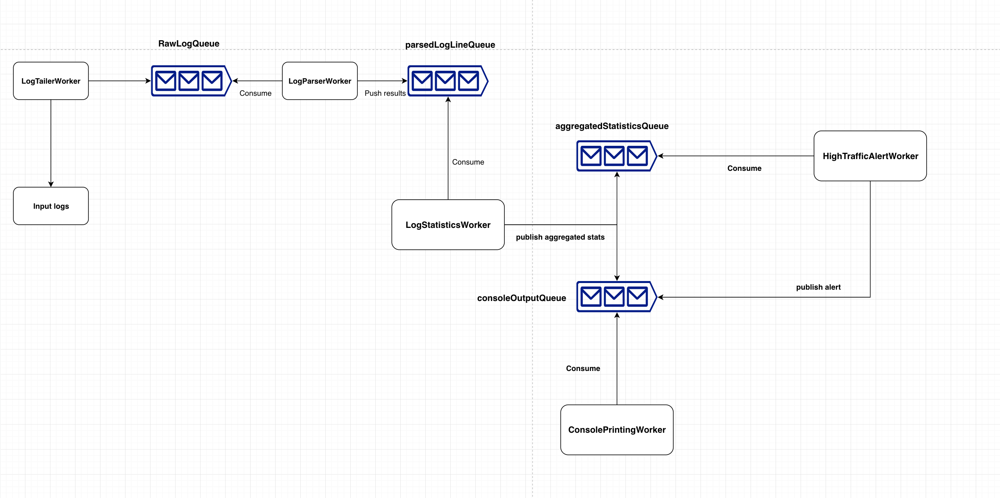

# Http log monitoring console program

This application will tail log file and produce aggregated traffic stats and high traffic alert if any.

## problem
At Datadog, we value working on real solutions to real problems, and as such we think the best way to understand your capabilities is to give you the opportunity to solve a problem similar to the ones we solve on a daily basis. 
As the next step in our process, we ask that you write a simple console program that monitors HTTP traffic on your machine. Treat this as an opportunity to show us how you would write something efficient, scalable, well-structured and maintainable.

## What is it
http-log-monitoring-console-program is a live application that tails traffic logs and produce aggregated traffic stats and high traffic alert if any.

## How to use
### Prerequisites
- JDK 8 & JRE installed
- Maven installed

All dependencies/executables are packaged in the application. You should be able to build and run it from any unix-like systems.

### Start the application
To reduce starting time we don't run unit tests on start the server.
It takes around half a sec to start the application
We will cover unit test in section below.
1. From command line:
   Navigate to root location of application where we define pom.xml, and execute:
```
 mvn exec:java
```
if we don't specify any command line input, we will use the default values from AppConfig.

### Configure the application
if you want to customize the application, there are four command line input supported:
1. **FileLocation**: where the log file stores and the application will tail the log file for any updates. 
By default the log file locates at {projectRoot}/rawLogs.txt
2. **StatsInterval**: publish aggregated traffic stats every _{**StatsInterval**}_ in second.
3. **AlertsInterval**: time window during which that high traffic evaluation would be run.
4. **RPSThreshold**: request per second threshold, above which during **AlertsInterval** a high traffic alert would
be triggered.

Help page:
```
usage: monitor [-a <arg>] [-f <arg>] [-r <arg>] [-s <arg>]
-a,--alerts-interval <arg>   length of the time window for monitoring the
alerts
-f,--file-location <arg>     location of the log file
-r,--max-rps <arg>           maximum requests per second threshold, after
which alert will fire
-s,--stats-interval <arg>    time interval after which stats will be
displayed
```
Example command:
```
mvn exec:java -Dexec.args=s=1,a=1,r=5
```

Example output:
```
================ STATISTICS ================
Time Frame: From timestamp  1549573859 to timestamp  1549573863
Total requests served: 19
Total content size: 23 KB
Top 5 sections by hits:
        api -> 13
        report -> 6
HTTP Methods by hits:
        GET -> 15
        POST -> 4
============= End OF STATISTICS =============

```

Example Alert:
```
========== A High Traffic Alert alert is now Active ==========

    hits: 15 during time window [ 1549573928, 1549573930 ]
    
================ End of an alert notification ================

```
## Test

### Run all unit test
```
mvn test
```

### Run a single/multiple unit test
```
mvn -Dtest=path1/to/test, path2/to/test test
```
### Run a single test method from a test class
```
mvn -Dtest=path1/to/test#methodname test
```
### Jacoco Integration
You can find Code coverage report under {projectRoot}/target/site/jacoco folder.

## System Architecture




## Application Flow and Components

### LogTailer

* Tails the log file for new logs which are appended to the end of the file.
* New log lines are added to an unbounded queue named `rawLogQueue` where `LogParserWorker` is listening to

### LogParserWorker

* A scheduled worker which runs every `stats-interval` seconds.
* It will check for all new content from `rawLogQueue` every `stats-interval` seconds
* It will consume all the new content from `rawLogQueue`, parse them and publish to the next queue, i.e. `parsedLogLineQueue`.

### LogStatisticsWorker

* It monitors any new content from `parsedLogLineQueue` and generate the `aggregatedStatistics`
* The generated aggregatedStatistics will be fan-out to two queues. One is `aggregatedStatisticsQueue` 
for future analysis usage(in our case, to generate high traffic alert), another one is `consoleOutputQueue` to print the stats.

### HighTrafficAlertWorker

* It monitors any new content from `aggregatedStatisticsQueue` in a FIFO circular buffer.
* Once reached the `alerts-interval`, calculate the current avg request per sec. Generate alarm if necessary.
* Remove the oldest stats

### ConsolePrintingWorker
* It listens to any new content from the `consoleOutputQueue` and publish the content to console.

### RawLogProducerWorker
To mock a live log file which continuously has more entries coming, I implemented a `RawLogProducerWorker` to copy entries from sample csv
to input location, so LogTailer can tail the log and put new content into the queue. In real world system this component is
not needed as the input log will grow automatically.


## Fault tolerance
* Any sort of exceptions which can occur are caught and logged.
* Each worker running is as a separate thread and if any thread terminates due to a failure during execution prior to shut down, a new one will take its place if needed to execute subsequent tasks.

## Availability

The application will keep running unless the user quits the application.

## Improvements ideas

* The runtime is limited by blocking queue operations, local machine computation resources. We can consider moving the application to cloud, e.g
  Using aws sqs for queue service, lambda to compute the stats, Kinesis/Athena for query and Redshift for DHW business analysis.
* The matching regex for log file parsing is hard-coded for now. Integrate with open csv
or other tools to enable more robust input parsing and validation.
* We only keep fixed amount of aggregated stats due to resource limit. If possible connect to a DDB to persist the log stats
* Once application terminates, all status would be lost. Implement failure recovery mechanism like ddb backup would be good.
* We can implement more stats reporting and even forecast, more than just display max/sum/avg. Integrate with machine learning forecast model to forecast
the potential upcoming traffic burst and alert the client
* We should be able to support more input format, tsv for example. Also not just a static file location, but the input log file
could be from cloud/internet/s3 etc.


